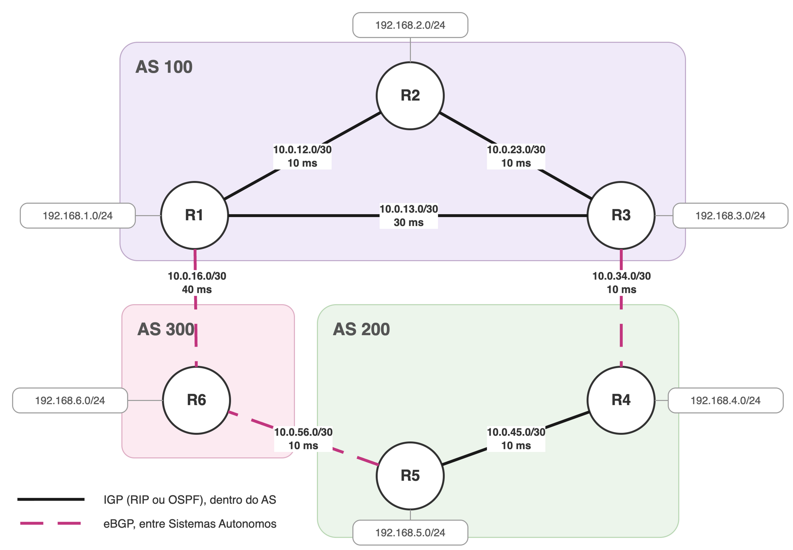
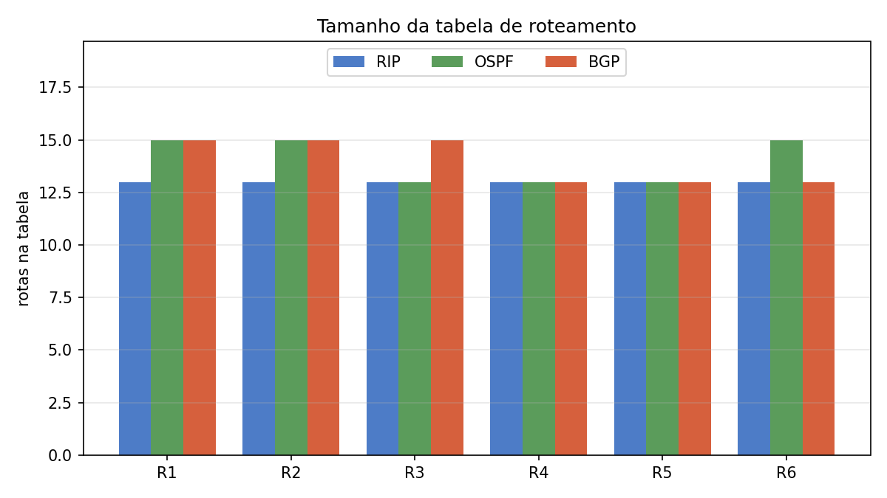
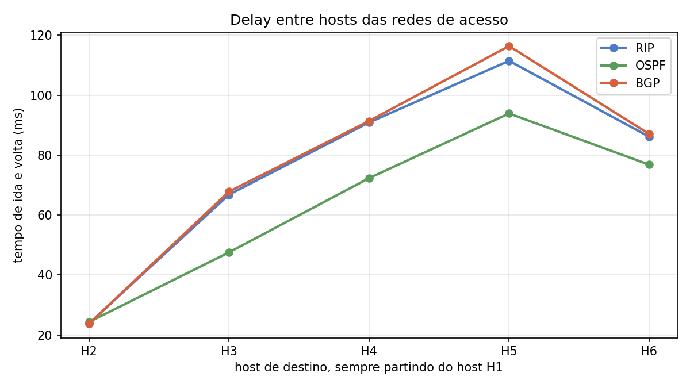
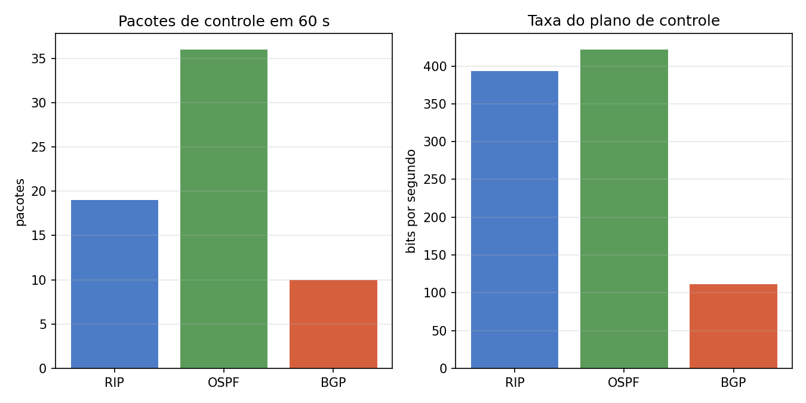
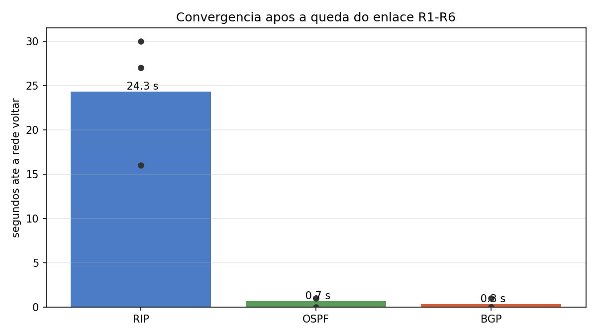

# Trabalho GA - Roteamento

## Objetivo

Montar um ambiente de roteamento com seis roteadores em três Sistemas Autônomos
e comparar RIP, OSPF e BGP rodando um de cada vez sobre a mesma topologia. A
plataforma usada é o FRRouting. Cada roteador e cada host é um network namespace
do Linux, os enlaces são pares veth e o atraso de cada enlace é configurado com
`tc netem`. Para cada protocolo são coletadas quatro métricas: tamanho da tabela
de roteamento, pacotes e taxa do tráfego de controle, delay entre hosts e tempo
de convergência depois da queda de um enlace.

## Ambiente

- macOS 15.2 em Apple Silicon (arm64)
- Lima, que roda a VM Linux no macOS
- Ubuntu 26.04 LTS dentro da VM
- FRR 10.5.1, do repositório oficial do Ubuntu

## Topologia



- **AS 100**: R1, R2 e R3
- **AS 200**: R4 e R5
- **AS 300**: R6
- **Sessões eBGP**: R3-R4, R5-R6 e R6-R1

### Endereçamento

| Função | Faixa | Regra |
|---|---|---|
| Redes de acesso | `192.168.X.0/24` | roteador no `.1`, host no `.10` |
| Enlaces | `10.0.AB.0/30` | A e B são os roteadores, o menor fica com o `.1` |
| Loopbacks | `172.16.0.X/32` | identificador do roteador no OSPF e no BGP |

| Enlace | Rede | Atraso de ida |
|---|---|---|
| R1-R2 | 10.0.12.0/30 | 10 ms |
| R2-R3 | 10.0.23.0/30 | 10 ms |
| R1-R3 | 10.0.13.0/30 | 30 ms |
| R3-R4 | 10.0.34.0/30 | 10 ms |
| R4-R5 | 10.0.45.0/30 | 10 ms |
| R5-R6 | 10.0.56.0/30 | 10 ms |
| R1-R6 | 10.0.16.0/30 | 40 ms |

Os atrasos representam enlaces de tipos diferentes: 10 ms nos curtos, 30 ms no
R1-R3, que é um caminho alternativo que dá a volta, e 40 ms no R1-R6, que é a
interligação de longa distância entre dois provedores. Sem os atrasos não haveria
diferenças notáveis entre os protocolos para a comparação.

## Como reproduzir

Os comandos das etapas 1 e 2 rodam no macOS. O resto roda dentro da VM.

### 1. Pré-requisitos

```
brew install lima
```

### 2. Criar a VM

```
limactl start --name=trabalhoGA-lab --cpus=2 --memory=4 --disk=20 --tty=false template://ubuntu-lts
limactl shell trabalhoGA-lab
```

Para editar os arquivos no macOS e rodar dentro da VM, a home precisa estar
montada com escrita. Em `~/.lima/trabalhoGA-lab/lima.yaml`, acrescentar
`writable: true` embaixo de `location: "~"`. Se mesmo assim a montagem subir como
somente leitura, dentro da VM:

```
sudo mount -o remount,rw /Users/$USER
```

### 3. Instalar o FRR

```
sudo apt update
sudo apt install -y frr frr-pythontools tcpdump
```

### 4. Desligar o serviço do sistema

O pacote sobe um FRR único no namespace raiz, que não é usado aqui. Então é
necessário rodar os seguintes comandos:

```
sudo systemctl stop frr
sudo systemctl disable frr
```

### 5. Liberar o AppArmor

Os perfis que vêm com o FRR bloqueiam as pastas por instância que a opção `-N`
usa e sem isso os daemons não sobem. Cole o bloco inteiro no terminal da VM:

```
sudo mkdir -p /etc/apparmor.d/abstractions/frr.d
sudo tee /etc/apparmor.d/abstractions/frr.d/lab.conf >/dev/null <<'EOF'
  @{run}/frr/*/ r,
  @{run}/frr/*/zserv.api rw,
  @{run}/frr/*/@{profile_name}.pid rwk,
  @{run}/frr/*/@{profile_name}.vty rw,
  @{run}/frr/*/mgmtd_be.sock rw,
  /etc/frr/*/ r,
  /etc/frr/*/@{profile_name}.conf rw,
  /etc/frr/*/frr.conf rw,
  /etc/frr/*/vtysh.conf r,
EOF
sudo apparmor_parser -r /etc/apparmor.d/{ospfd,ripd,bgpd,staticd}
sudo chmod 750 /etc/frr
```

### 6. Clonar o repositório

```
cd /Users/$USER
git clone <url do repositorio>
cd trabalhoGA-redes
```

### 7. Subir a topologia

Na raiz do repositório, dentro da VM:

```
sudo bash scripts/topologia.sh
```

Isso cria os doze namespaces, os sete enlaces com os atrasos e os seis hosts. Para
conferir:

```
sudo ip netns list
sudo ip netns exec h1 ip route
```

## Rodando cada protocolo

Um protocolo de cada vez. O mesmo script serve para os três, mudando só o
argumento:

```
sudo bash scripts/up-frr.sh rip
sudo bash scripts/up-frr.sh ospf
sudo bash scripts/up-frr.sh bgp
```

O script derruba o que estiver rodando, instala a configuração de
`configs/<protocolo>/` em cada roteador e sobe o `mgmtd`, o `zebra` e o daemon do
protocolo em cada namespace.

O RIP leva cerca de um minuto para convergir e os outros dois levam segundos.
Para conferir:

```
sudo ip netns exec r1 vtysh -N r1 -c "show ip route"
sudo ip netns exec h1 ping -c 3 192.168.5.10
```

Para derrubar tudo:

```
sudo bash scripts/down-frr.sh
```

## Coleta de métricas

Para a coleta das métricas apenas rodar os comandos abaixo com argumento do
protocolo escolhido (ex: rip). Na convergência, o número de repetições vai como
segundo parâmetro (ex: 3):

```
sudo bash scripts/metric-table.sh rip
sudo bash scripts/metric-delay.sh rip
sudo bash scripts/metric-traffic.sh rip
sudo bash scripts/metric-convergence.sh rip 3
```

| Script | O que mede |
|---|---|
| `metric-table.sh` | quantas rotas cada roteador guarda na tabela do kernel |
| `metric-traffic.sh` | pacotes e bits por segundo do protocolo, em 60 segundos de captura no R1 |
| `metric-delay.sh` | ida e volta do host H1 até os outros cinco hosts, média de dez pacotes |
| `metric-convergence.sh` | tempo até a rede voltar depois que o enlace R1-R6 cai |

## Resultados

### Tamanho da tabela de roteamento



Todos os roteadores guardam as treze redes da topologia. As linhas a mais no OSPF
e no BGP são caminhos de custo equivalente instalados em paralelo.

### Delay



O OSPF chega antes em todos os destinos. Até a rede do R3 ele desvia do enlace
direto de 30 ms e vai pelo R2, e até a rede do R5 ele escolhe quatro saltos em vez
de dois. O RIP e o BGP ficam praticamente sobrepostos, por critérios diferentes:
um conta saltos, o outro conta Sistemas Autônomos.

### Tráfego de controle



O OSPF mandou 36 pacotes em um minuto, o RIP 19 e o BGP 10. O OSPF envia hello a
cada dez segundos em cada enlace. O RIP envia a cada trinta segundos, mas manda a
tabela inteira. O BGP só envia quando alguma rota muda.

### Convergência



O RIP leva mais de vinte segundos e varia bastante entre as repetições. O OSPF e o
BGP se recuperam em menos de um segundo.

## Vídeo

Demonstração dos três cenários rodando, com a queda do enlace R1-R6 em cada um:
[`demo.mp4`](demo.mp4).
